

<a href="https://apps.apple.com/us/app/pdhd-dialysis-companion/id6761768841">
  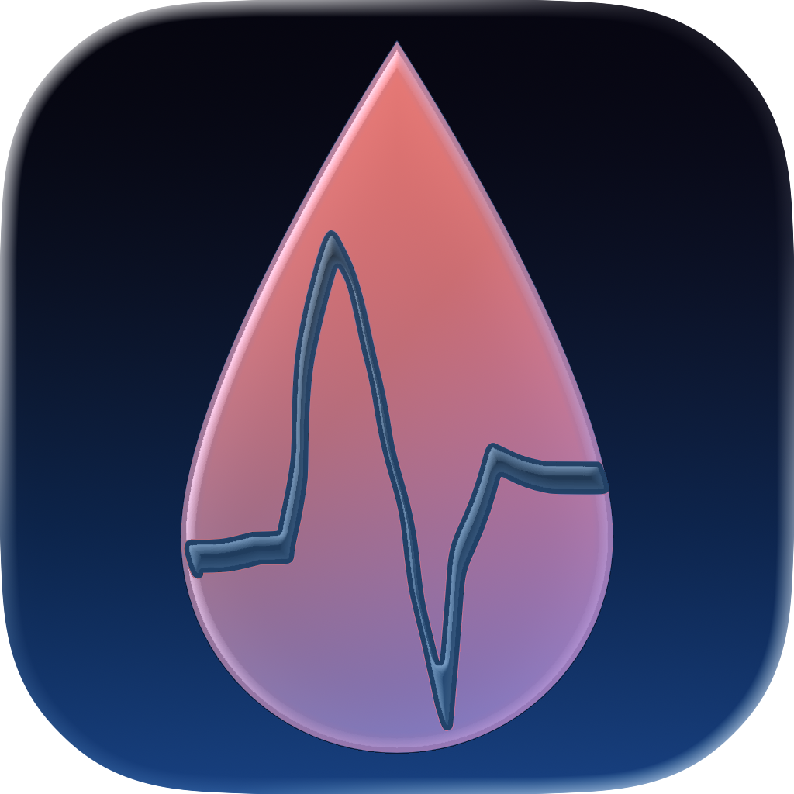
</a>

# PDHD — Dialysis Companion

**A peritoneal dialysis (PD) management companion for iPhone, iPad, Apple Watch, and Mac. Built 100% with Apple frameworks. Zero external dependencies. All data stays on-device.**

---

## Why This App Exists

People living with end-stage renal disease (ESRD) on **peritoneal dialysis (PD)** perform 3–5 fluid exchanges every single day, monitor their inventory of dialysate bags, watch their fluid balance, weight, blood pressure, and lab values — and coordinate it all with a remote nephrology team.

The tools available to them are mostly paper logbooks, vendor portals locked behind logins, and generic health apps that do not understand PD.

**PDHD — Dialysis Companion** is built for that gap:

- A **single, fast place** to log every PD session with the values that actually matter: fill volume, drain volume, glucose concentration, ultrafiltration, electrolytes, blood pressure.
- **Inventory you can trust** — a live donut chart of supplies on hand, predictive reorder alerts, delivery history, and EventKit calendar reminders so the next box arrives before the last one runs out.
- **Trends grounded in clinical evidence** — reference ranges and targets sourced from **KDIGO 2024**, **ISPD 2019**, **ADA / KDIGO 2022**, and **KDOQI 2015** guidelines, so a value flagged as out-of-range is genuinely meaningful.
- **Built around Apple Health** — weight, blood pressure, blood glucose, and lab values flow through HealthKit so they stay in sync with everything else on the device.
- **All on-device, always.** No accounts. No subscriptions. No external servers. Nothing leaves the iPhone, iPad, Apple Watch, or Mac unless the user chooses to sync via their own iCloud account.

It is the app I wanted to exist for the people in my life who depend on PD — clinically credible, genuinely private, and built to the same engineering bar as a first-party Apple health app.

---

## Available on the App Store

### [PDHD — Dialysis Companion on the App Store ↗](https://apps.apple.com/us/app/pdhd-dialysis-companion/id6761768841)

**Category:** Medical · Health & Fitness  &nbsp;|&nbsp;  **Price:** Free  &nbsp;|&nbsp;  **Min OS:** iOS 18.0

---

## Screenshots

<table>
  <tr>
    <td align="center" width="25%">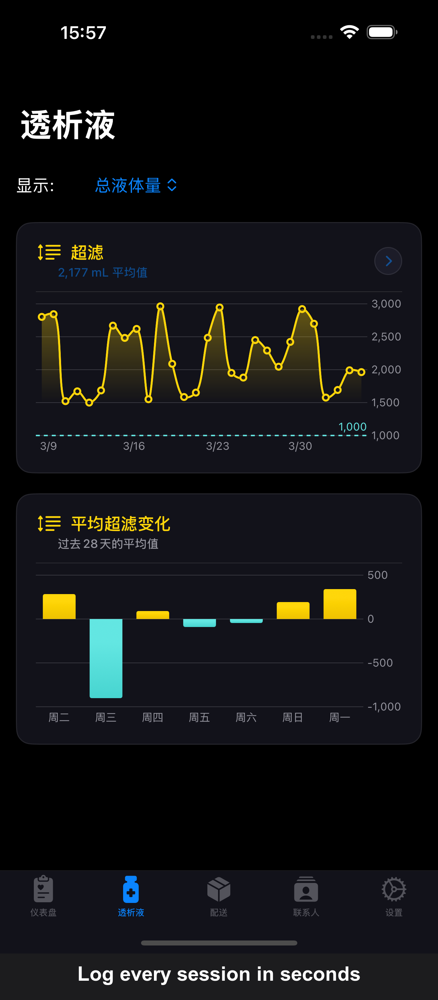 <b>PD Sessions</b></td>
    <td align="center" width="25%">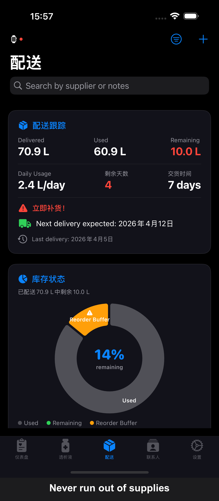 <b>Supply Inventory</b></td>
    <td align="center" width="25%">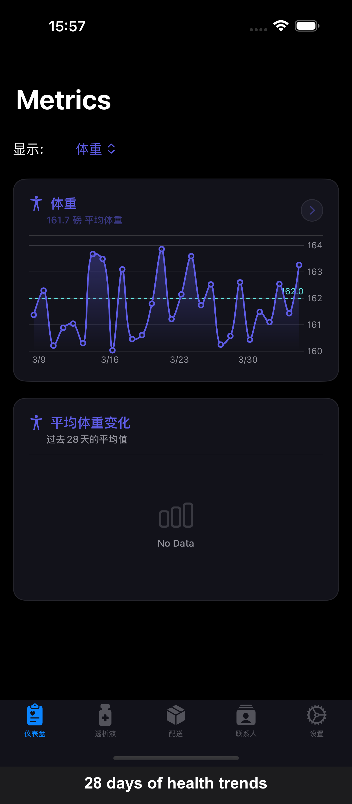 <b>Health Trends</b></td>
  </tr>
  <tr>
    <td align="center" width="25%">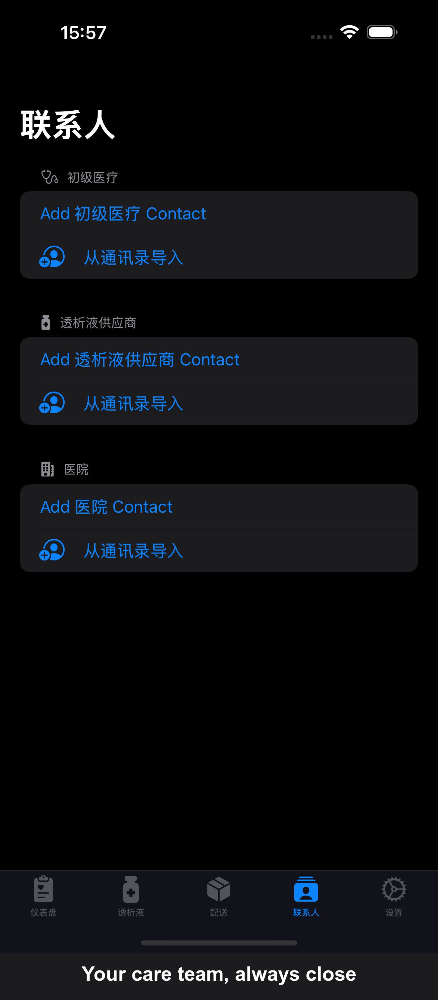 <b>Care Team Contacts</b></td>
    <td align="center" width="25%">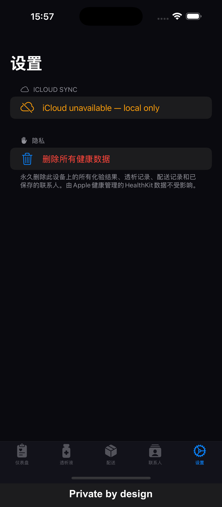 <b>Face ID Security</b></td>
    <td align="center" width="25%">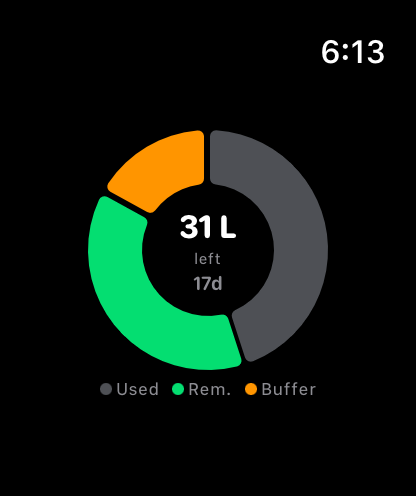 <b>Apple Watch</b></td>
  </tr>
</table>

---

## Architecture

PDHD is a **multi-target Swift 6 app** built on **MVVM with `@Observable` managers**, **protocol-based dependency injection**, and a **shared local Swift package (`PDHDShared`)** that holds the canonical model layer used by every target.

### Multi-Target Layout

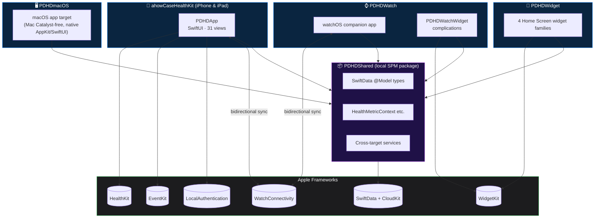

### Layered Application Architecture

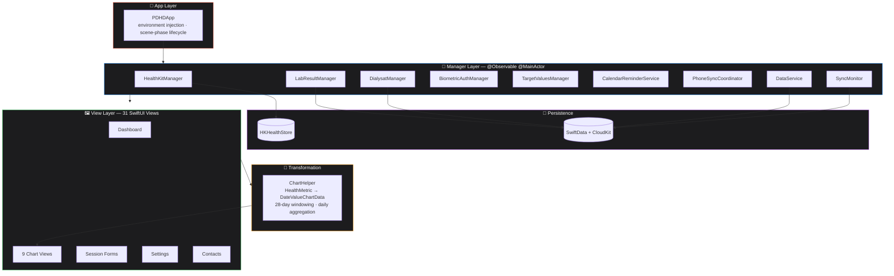

### Protocol-Based Dependency Injection

A single protocol abstracts HealthKit so the entire health-data path can be swapped for a mock in tests — no HealthKit simulator required.

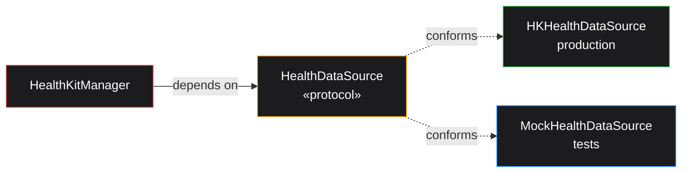

### Data Models (`PDHDShared`)

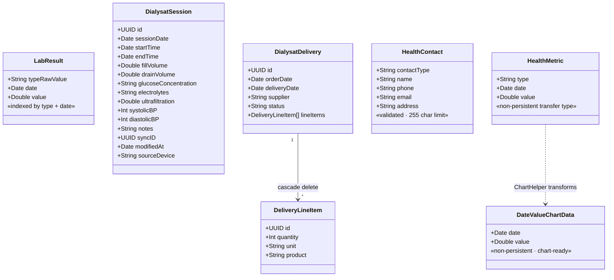

### Data Pipeline — From Source to Chart

```mermaid
flowchart LR
    subgraph Source["Data Sources"]
        HK[(HKHealthStore)]
        SD[(SwiftData)]
    end
    subgraph Protocol["Abstraction"]
        HDS["HealthDataSource\n«protocol»"]
    end
    subgraph Transfer["Transfer"]
        HM["HealthMetric\n12 metric types\ncolors · units · clinical targets"]
    end
    subgraph Transform["Transform"]
        CH["ChartHelper\n28-day window · daily aggregation"]
    end
    subgraph Ready["Chart-Ready"]
        DVC["DateValueChartData\ndate + value"]
    end
    subgraph Render["9 Chart Views"]
        WL["Weight Line"]
        WD["Weight Δ"]
        BSL["Blood Sugar Line"]
        BSD["Blood Sugar Δ"]
        BPL["Blood Pressure Line"]
        BPD["Blood Pressure Δ"]
        LL["Lab Line"]
        LD["Lab Δ"]
        ID["Inventory Donut"]
    end

    HK --> HDS
    SD --> HDS
    HDS --> HM
    HM --> CH
    CH --> DVC
    DVC --> Render

    style Source fill:#1C1C1E,stroke:#BF5AF2,color:#FFFFFF
    style Protocol fill:#1C1C1E,stroke:#FF9F0A,color:#FFFFFF
    style Transfer fill:#1C1C1E,stroke:#0A84FF,color:#FFFFFF
    style Transform fill:#1C1C1E,stroke:#34C759,color:#FFFFFF
    style Ready fill:#1C1C1E,stroke:#FF2D55,color:#FFFFFF
    style Render fill:#1C1C1E,stroke:#F05138,color:#FFFFFF
```

All chart views share a single `ChartContainer` wrapper with **Catmull-Rom interpolation**, **haptic feedback on selection**, and **empty-state overlays**.

---

## Accessibility

Accessibility is treated as a first-class requirement, not a final pass. Every chart, every form, every sheet is exercised with **VoiceOver** and an **automated accessibility audit** in CI.

| Area | Implementation |
|---|---|
| **VoiceOver** | Full labels, hints, and traits on every interactive element. Decorative graphics marked `.accessibilityHidden(true)`. |
| **Chart Accessibility** | All 9 charts expose **`AXChartDescriptor`** with 3 descriptor variants — single series, dual series, and donut — so VoiceOver can read out chart contents and trends. |
| **Dynamic Type** | No hardcoded point sizes anywhere. Every label uses semantic text styles (`.body`, `.headline`, `.caption`) so they scale with the user's preferred text size, including the **Accessibility XXXL** sizes. |
| **Color & Contrast** | All status colors validated against WCAG AA contrast ratios. Color is never the sole carrier of meaning — every clinical-target indicator pairs color with a glyph. |
| **Reduced Motion** | Animations check `@Environment(\.accessibilityReduceMotion)` and degrade to instant transitions when requested. |
| **Hit Targets** | All controls meet or exceed Apple's 44 × 44 pt minimum tap target. |
| **Automated Audit** | UI tests run **`app.performAccessibilityAudit(for: .all)`** to catch missing labels, contrast failures, dynamic-type clipping, and unreachable elements before every release. |

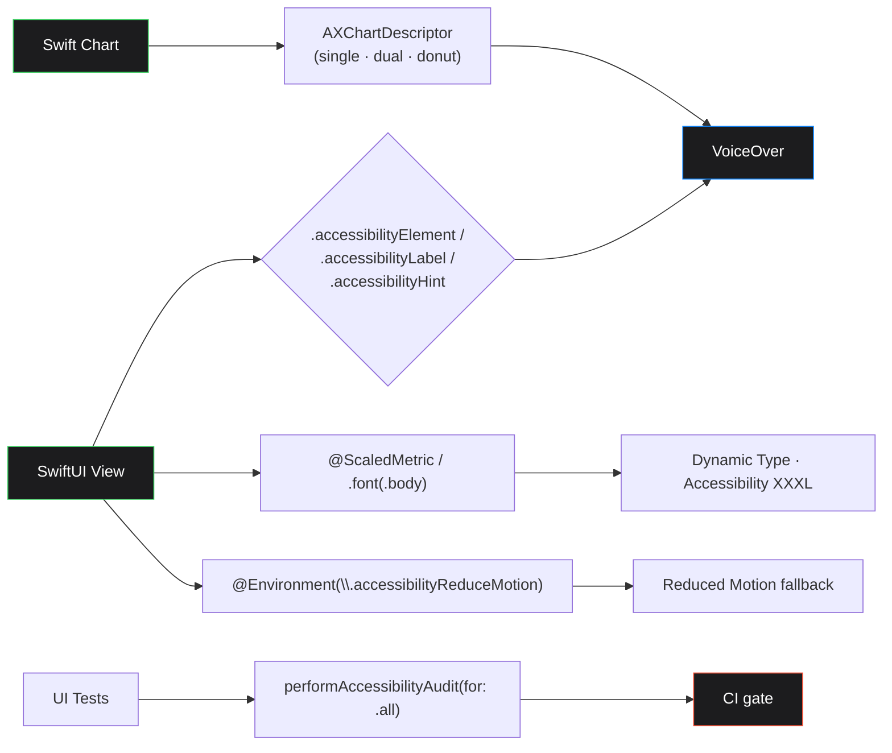

---

## Privacy

PDHD is **on-device by default** and **on-device only** for clinical data. There is no analytics SDK, no telemetry pipeline, no marketing ID, no third-party network call.

| Privacy Measure | What it Means |
|---|---|
| **No accounts, no servers** | The app does not have a backend. There is no PDHD account to sign up for. |
| **No third-party SDKs** | Zero external dependencies — every line of code is either Apple's or this project's. |
| **iCloud sync is opt-in & user-owned** | SwiftData syncs through CloudKit using the user's own iCloud account. Data flows Apple-device → Apple iCloud → user's other Apple devices. It never enters PDHD-controlled infrastructure. |
| **PII masking on contacts** | Phone numbers display as `••• ••• 1234`; email addresses display as `•••@example.com`. Full values are revealed only on explicit tap. |
| **`PrivacyInfo.xcprivacy`** | Manifest declares every privacy-sensitive API used (UserDefaults, file timestamps) with the corresponding Apple-defined reason codes. |
| **Privacy overlay on backgrounding** | Sensitive views are blurred the moment the scene phase becomes `.inactive`, before the app appears in the App Switcher. |
| **In-memory clearing on `.background`** | Sensitive transient state is zeroed when the app is backgrounded, so a memory snapshot from another process cannot reveal recently viewed values. |
| **`OSLog` privacy redaction** | Every log statement that touches user data uses `privacy: .private` so values are stripped from sysdiagnose archives. |
| **Privacy Policy** | [chapter.de/pdhd/privacy](https://www.chapter.de/pdhd/privacy.html) |

---

## Stability

The app is designed so that **no single failing subsystem can take the experience down**.

| Failure Mode | Mitigation |
|---|---|
| **HealthKit denied or unavailable** | App still launches; affected charts render an empty-state overlay with a deep link into Health permissions. No crash, no blocked screen. |
| **CloudKit unreachable** | SwiftData transparently falls back to a **local store**. The user keeps writing; sync resumes on its own. |
| **WatchConnectivity unreliable** | Sync uses **`syncID` + `modifiedAt` last-write-wins** with idempotent payloads. A dropped or duplicated message cannot corrupt the database. |
| **Calendar / EventKit denied** | Reorder reminders silently degrade to in-app notifications; the inventory feature continues to work. |
| **Face ID unavailable** (no enrolled face, no hardware) | App falls back to device passcode via `LocalAuthentication`'s `deviceOwnerAuthentication` policy. |
| **Empty data sets** | Every chart and list has a designed empty state — never a blank screen, never a crash. |
| **Range-violating input** | Every numeric form uses validated input with clinical reference ranges; out-of-range values are caught at entry, not at persistence. |
| **`SyncMonitor` observability** | A dedicated `SyncMonitor` observes CloudKit sync events so any sync stall is surfaced in Settings instead of failing silently. |

### Test Surface

| Suite | Files | Framework |
|---|---|---|
| Unit tests | **16** | Swift Testing (`@Suite`, `@Test`, `#expect`) |
| UI tests | **5** | XCTest + screenshot generation + accessibility audit |

Unit tests use **in-memory `ModelContainer`** for SwiftData and **`MockHealthDataSource`** for HealthKit, so the entire suite runs on a clean simulator with no permission prompts and no shared state.

---

## Security

PDHD applies **defense in depth** — biometric auth, encryption at rest, runtime privacy guards, and strict input validation work together.

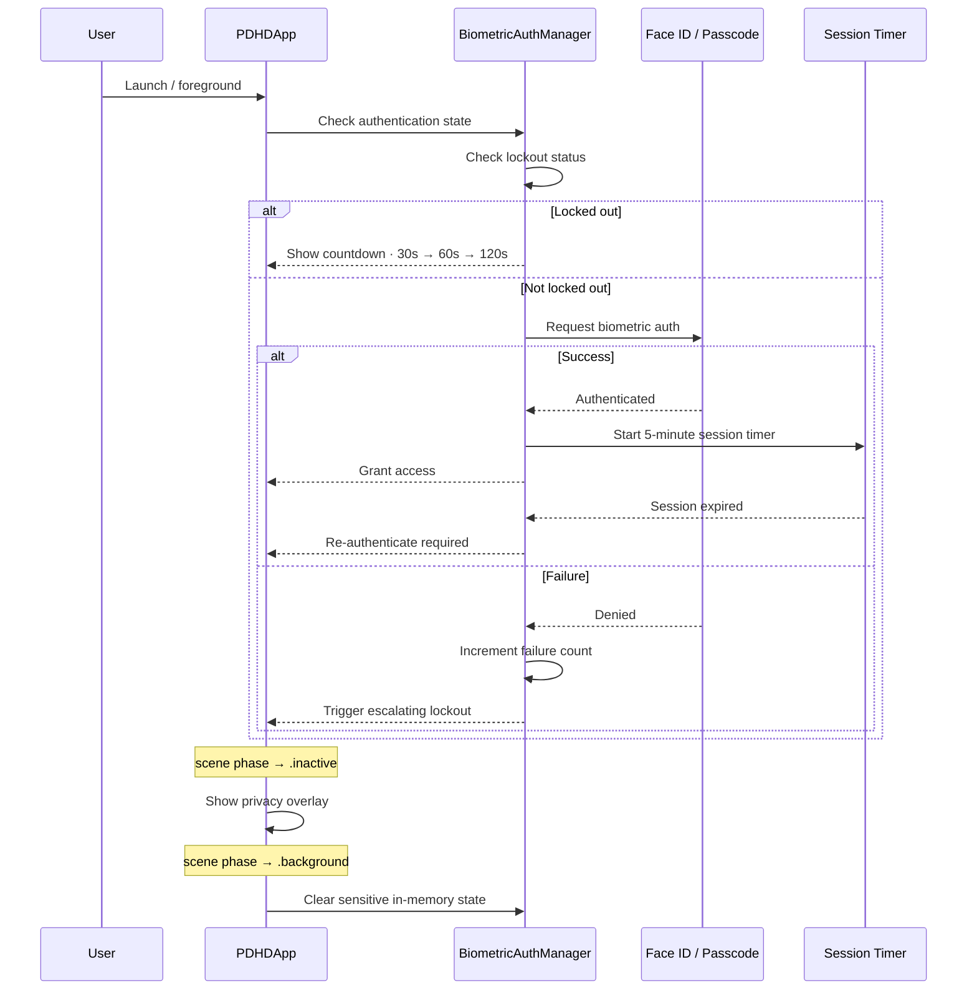

| Layer | Control |
|---|---|
| **Authentication** | **Face ID / Touch ID** via `LocalAuthentication` with **5-minute session timeout** and **escalating brute-force lockout** (30s → 60s → 120s). Falls back to device passcode when biometrics are unavailable. |
| **Encryption at rest** | **`NSFileProtectionComplete`** on every SwiftData store file — data is decryptable only while the device is unlocked. |
| **Memory hygiene** | Sensitive view-model state is cleared on background transitions so a process snapshot cannot leak. |
| **PII masking** | Phone last-4 only; email domain only; reveal requires explicit tap. |
| **Input validation** | Numeric range checks against clinical reference ranges, email format validation, control-character stripping, 255-char limits on free-text contact fields. |
| **Logging** | All logs that touch user data go through **`OSLog` with `privacy: .private`** — values stripped from sysdiagnose. |
| **Manifest** | **`PrivacyInfo.xcprivacy`** declares every privacy-sensitive API with reason codes. |
| **No external network** | No analytics, no SDKs, no servers — the smallest possible attack surface. |

---

## Concurrency

PDHD targets **Swift 6 strict concurrency** end-to-end. Every concurrency boundary is explicit; no `@unchecked Sendable` shortcuts.

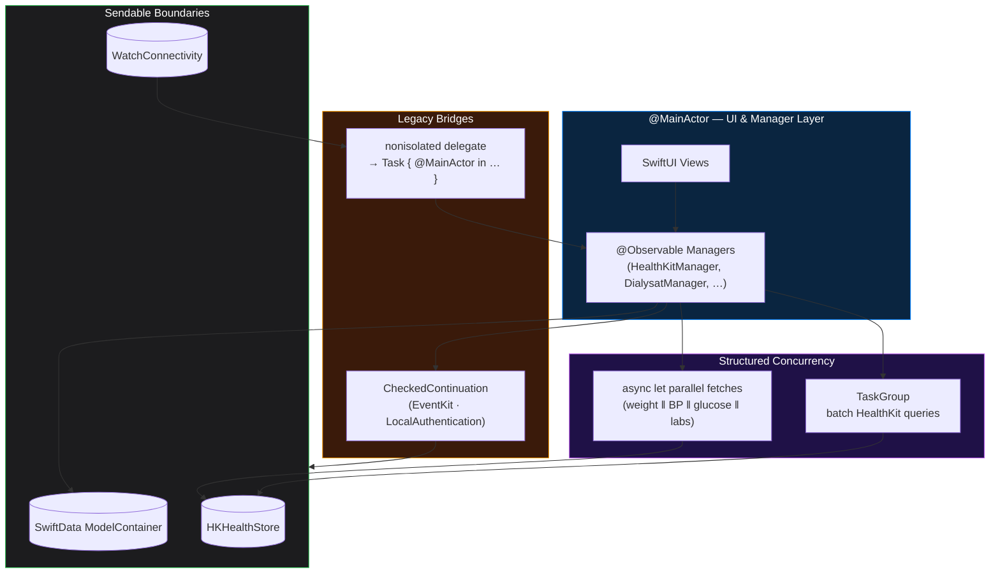

| Pattern | Where it's used |
|---|---|
| **`@Observable @MainActor` managers** | Every state-holding manager is main-actor isolated by default — UI reads are race-free without locks. |
| **Structured `async let` parallel fetches** | The dashboard fan-outs four HealthKit queries in parallel and gathers them in one frame. |
| **`CheckedContinuation` bridges** | EventKit's completion-handler API and `LocalAuthentication` are wrapped into `async` functions cleanly. |
| **`nonisolated` delegates** | `WatchConnectivity` delegate methods are `nonisolated` and explicitly hop back via `Task { @MainActor in … }` — no implicit actor inheritance. |
| **`Sendable` payloads only** | Cross-actor boundaries carry only `Sendable` value types (DTOs, IDs, dates). |
| **Last-write-wins sync** | Watch / phone sync uses `syncID + modifiedAt` so concurrent edits resolve deterministically. |

---

## Language Support

The app ships with **8 languages**, fully localized — including UI strings, dates, numbers, units, and App Store metadata.

| Code | Language |
|---|---|
| `en-US` | English (United States) |
| `de-DE` | Deutsch (German) |
| `fr-FR` | Français (French) |
| `es-ES` | Español (Spanish) |
| `pt-BR` | Português (Brazilian Portuguese) |
| `ar-SA` | العربية (Arabic) — RTL |
| `ja` | 日本語 (Japanese) |
| `zh-Hans` | 简体中文 (Simplified Chinese) |

Localization uses **String Catalogs (`.xcstrings`)** for both source and translations, so plurals, device variants, and units are handled per locale instead of per-string.

---

## Tech Stack

100% Apple. Zero external SDKs. No CocoaPods, no Carthage, no third-party SPM packages.

| Framework | Purpose |
|---|---|
| **Swift 6.0** | Strict-concurrency-checked source, value semantics, sendable enforcement |
| **SwiftUI** | Declarative UI across iPhone, iPad, Apple Watch, Mac, and Widgets |
| **SwiftData** | Persistence layer — `@Model` types in `PDHDShared`, in-memory mode for tests |
| **CloudKit** | Optional opt-in sync of SwiftData stores via the user's own iCloud account |
| **HealthKit** | Read & write of weight, blood pressure, blood glucose, lab values |
| **HealthKitUI** | Native permission-priming views |
| **Swift Charts** | 9 interactive chart views with Catmull-Rom interpolation and `AXChartDescriptor` |
| **WatchConnectivity** | Bidirectional iPhone ⇄ Apple Watch sync with last-write-wins resolution |
| **WidgetKit** | 4 Home Screen widget families + Watch complications, with deep links into the app |
| **AppIntents** | Spotlight, Shortcuts, and Siri exposure of key entities |
| **EventKit** | Calendar reminders for supply reorders |
| **Contacts** | Care-team contact management |
| **LocalAuthentication** | Face ID / Touch ID / device passcode |
| **Foundation** | Async/await networking, `FormatStyle`, `Measurement`, ISO 8601 |
| **`os` / `OSLog`** | Structured, privacy-redacted logging |
| **Swift Testing** | `@Suite`, `@Test`, `#expect`-based unit tests (16 files) |
| **XCTest + XCUITest** | UI flows, screenshot capture, accessibility audit (5 files) |

### Targets

| Target | Platform |
|---|---|
| `ahowCaseHealthKit` | iPhone & iPad app |
| `PDHDmacOS` | Mac app (native, not Catalyst) |
| `PDHDWatch` | watchOS companion app |
| `PDHDWatchWidget` | Watch complications |
| `PDHDWidget` | iOS Home Screen / Lock Screen widgets |
| `PDHDShared` | Local Swift package — models, services, enums |

### Requirements

| | Version |
|---|---|
| iOS / iPadOS | 18.0+ |
| watchOS | 11.0+ |
| macOS | 15.0+ |
| Xcode | 16.0+ |
| Swift | 6.0 |

---

## Highlights at a Glance

| Highlight | Detail |
|---|---|
| 📲 **Live on the App Store** | [PDHD — Dialysis Companion](https://apps.apple.com/us/app/pdhd-dialysis-companion/id6761768841) — Medical · Health & Fitness — Free |
| 🧠 **Clinically credible** | Reference ranges from KDIGO 2024, ISPD 2019, ADA / KDIGO 2022, KDOQI 2015 |
| 🔒 **Private by construction** | No accounts, no servers, no telemetry; iCloud sync is opt-in and user-owned |
| 🛡 **Defense in depth** | Face ID + 5-min auto-lock + escalating lockout + `NSFileProtectionComplete` + privacy overlay + memory clearing |
| ⚡️ **Swift 6 strict concurrency** | `@Observable @MainActor` managers, `async let` parallel fetches, no `@unchecked Sendable` |
| ♿️ **Accessibility-first** | VoiceOver everywhere, `AXChartDescriptor` on all 9 charts, automated audit in CI |
| 🌍 **8 languages** | en, de, fr, es, pt-BR, ar (RTL), ja, zh-Hans |
| 🧩 **6 targets, one shared package** | iPhone, iPad, Mac, Watch, Watch widget, iOS widget — all sharing `PDHDShared` |
| 🪶 **Zero external dependencies** | 100% Apple frameworks — no CocoaPods, no third-party SPM, no Carthage |
| 🧪 **Tested & audited** | 16 unit-test files (Swift Testing), 5 UI-test files (XCUITest + accessibility audit) |

---

## License

This project's documentation is published under the **MIT License**. The PDHD app source itself is private; see [LICENSE](LICENSE) for the documentation terms.

---

**Built with Swift and Apple frameworks. Zero external dependencies. All data stays on the user's device.**

